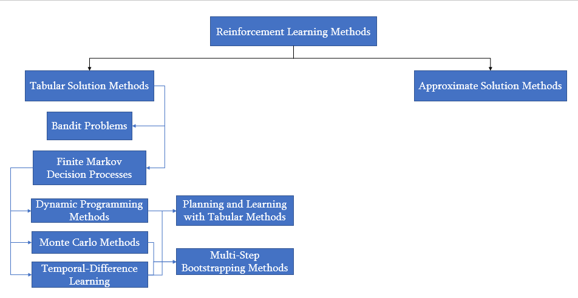

# Reinforcement Learning Projects

## Introduction to Reinforcement Learning (RL)

**Reinforcement Learning (RL)** is a branch of machine learning where an agent learns to make decisions by interacting with an environment. The agent takes actions, observes outcomes (states and rewards), and learns to maximize cumulative reward over time. Unlike supervised learning, RL doesn’t rely on labeled data—instead, it learns from trial and error.

Key components of RL:
- **Agent**: The learner or decision maker.
- **Environment**: What the agent interacts with.
- **State**: A representation of the current situation.
- **Action**: Choices the agent can make.
- **Reward**: Feedback from the environment.
- **Policy**: The strategy the agent uses to choose actions.
- **Value Function**: Predicts future rewards.

RL is widely used in robotics, game AI, finance, and more—where sequential decision-making is key.

---

## Overview of Reinforcement Learning Methods

**Reinforcement Learning Methods**

This diagram breaks down RL methods into two primary categories:
#### 1.Tabular Solution Methods (used when the state/action space is small and manageable)
- **Bandit Problems**
- **Finite Markov Decision Processes**
  - **Dynamic Programming Methods**
  - **Monte Carlo Methods**
  - **Temporal-Difference Learning**
    - Planning and Learning with Tabular Methods (combination of Dynamic Programming Methods and Temporal-Difference Learning)
    - Multi-Step Bootstrapping Methods(combination of Monte Carlo Methods and Temporal-Difference Learning) 
#### 2.Approximate Solution Methods (used for large or continuous spaces)

---

## My Projects
### 1. [**Tic-Tac-Toe**](https://github.com/AlisaSujyan/Reinforcement-Learning/tree/main/tic-tac-toe)
 Is a simple RL project which demonstrates the application of Reinforcement Learning (RL) in solving the Gambler's Problem using value iteration. The agent learns an optimal betting strategy by estimating the probability of reaching the goal from each state, improving its value function through successive iterations.
### 2. [**10-Armed Bandit Problem**](https://github.com/AlisaSujyan/Reinforcement-Learning/tree/main/ten-armed-testbed)
- **Category**: Bandit Problems
- **Summary**: Solving a non-sequential decision-making problem where the agent picks from 10 options, aiming to discover the most rewarding one over time.
- **Key Techniques**: greedy, ε-greedy, UCB, GBA

---

### 3. [**Grid World MDP**](https://github.com/AlisaSujyan/Reinforcement-Learning/tree/main/gridworld_mdp)
- **Category**: Finite Markov Decision Processes (MDPs)
- **Summary**: A grid-based environment modeled as an MDP where the agent learns to reach a goal.
- **Key Techniques**: State transitions, rewards, policy/value functions

---

### 4. [**Grid World with Dynamic Programming**](https://github.com/AlisaSujyan/Reinforcement-Learning/tree/main/gridworld-dp)
- **Category**: Dynamic Programming Methods
- **Summary**: Uses policy iteration and value iteration to solve the Grid World environment with a known model.
- **Key Techniques**: Bellman equations, iterative updates

---

### 5. [**Gambler’s Problem**](https://github.com/AlisaSujyan/Reinforcement-Learning/tree/main/gambler-problem)
- **Category**: Dynamic Programming Methods
- **Summary**: The agent decides how much to bet to reach a goal. Solved using value iteration.
- **Key Techniques**: Value iteration, convergence analysis

---

