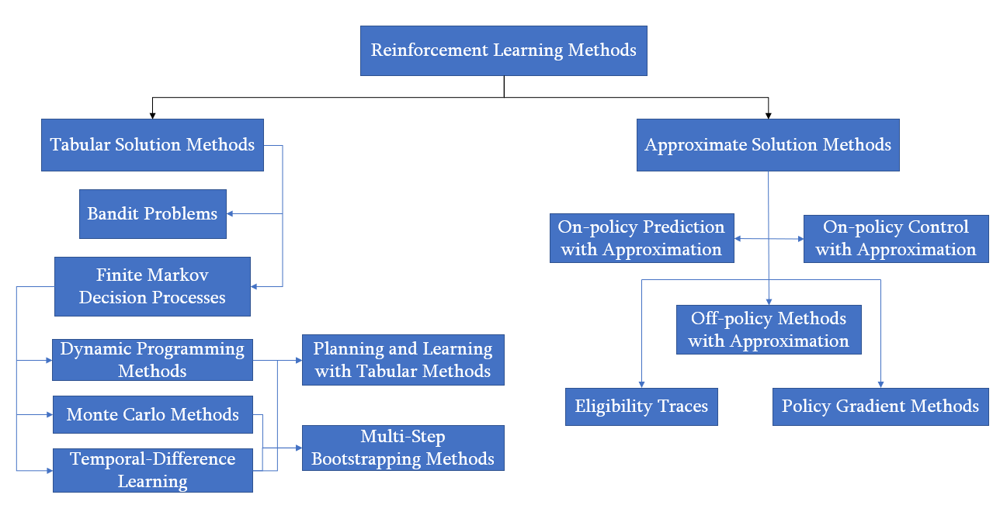

# Reinforcement Learning Projects

## Introduction to Reinforcement Learning (RL)

**Reinforcement Learning (RL)** is a branch of machine learning where an agent learns to make decisions by interacting with an environment. The agent takes actions, observes outcomes (states and rewards), and learns to maximize cumulative reward over time. Unlike supervised learning, RL doesn’t rely on labeled data—instead, it learns from trial and error.

Key components of RL:
- **Agent**: The learner or decision maker.
- **Environment**: What the agent interacts with.
- **State**: A representation of the current situation.
- **Action**: Choices the agent can make.
- **Reward**: Feedback from the environment.
- **Policy**: The strategy the agent uses to choose actions.
- **Value Function**: Predicts future rewards.

RL is widely used in robotics, game AI, finance, and more—where sequential decision-making is key.

---

## Overview of Reinforcement Learning Methods

**Reinforcement Learning Methods**

This diagram breaks down RL methods into two primary categories:
#### 1.Tabular Solution Methods (used when the state/action space is small and manageable)
- **Bandit Problems**
- **Finite Markov Decision Processes**
  - **Dynamic Programming Methods**
  - **Monte Carlo Methods**
  - **Temporal-Difference Learning**
    - Planning and Learning with Tabular Methods (combination of Dynamic Programming Methods and Temporal-Difference Learning)
    - Multi-Step Bootstrapping Methods(combination of Monte Carlo Methods and Temporal-Difference Learning) 
#### 2.Approximate Solution Methods (used for large or continuous spaces)
When dealing with **large or continuous state spaces**, exact tabular methods become impractical.
Approximate methods generalize experience using **function approximation** — representing value functions with parameterized functions (e.g., linear combinations of features).

---

## My Projects

---

## Tabular Solution Methods

---

### 1. [**Tic-Tac-Toe**](https://github.com/AlisaSujyan/Reinforcement-Learning/tree/main/tic-tac-toe)
 Is a simple RL project which demonstrates the application of Reinforcement Learning (RL) in solving the Gambler's Problem using value iteration. The agent learns an optimal betting strategy by estimating the probability of reaching the goal from each state, improving its value function through successive iterations.
### 2. [**10-Armed Bandit Problem**](https://github.com/AlisaSujyan/Reinforcement-Learning/tree/main/ten-armed-testbed)
- **Category**: Bandit Problems
- **Summary**: Solving a non-sequential decision-making problem where the agent picks from 10 options, aiming to discover the most rewarding one over time.
- **Key Techniques**: greedy, ε-greedy, UCB, GBA

---

### 3. [**Grid World MDP**](https://github.com/AlisaSujyan/Reinforcement-Learning/tree/main/gridworld_mdp)
- **Category**: Finite Markov Decision Processes (MDPs)
- **Summary**: A grid-based environment modeled as an MDP where the agent learns to reach a goal.
- **Key Techniques**: State transitions, rewards, policy/value functions

---

### 4. [**Grid World with Dynamic Programming**](https://github.com/AlisaSujyan/Reinforcement-Learning/tree/main/gridworld-dp)
- **Category**: Dynamic Programming Methods
- **Summary**: Uses policy iteration and value iteration to solve the Grid World environment with a known model.
- **Key Techniques**: Bellman equations, iterative updates

---

### 5. [**Gambler’s Problem**](https://github.com/AlisaSujyan/Reinforcement-Learning/tree/main/gambler-problem)
- **Category**: Dynamic Programming Methods
- **Summary**: The agent decides how much to bet to reach a goal. Solved using value iteration.
- **Key Techniques**: Value iteration, convergence analysis

---

### 6. [**Blackjack**](https://github.com/AlisaSujyan/Reinforcement-Learning/tree/main/blackjack)
- **Category**: Monte Carlo Methods
- **Summary**: A card game environment where the agent learns an optimal policy by sampling complete episodes and averaging returns.
- **Key Techniques**: First-visit Monte Carlo, ε-greedy policy improvement

---

### 7. [**Infinite Variance**](https://github.com/AlisaSujyan/Reinforcement-Learning/tree/main/infinite-variance)
- **Category**: Monte Carlo Methods (Off-Policy)
- **Summary**: Demonstrates the problem of infinite variance when estimating a target policy using samples from a different behavior policy with importance sampling.
- **Key Techniques**: Importance sampling, variance analysis

---

### 8. [**Random Walk**](https://github.com/AlisaSujyan/Reinforcement-Learning/tree/main/random-walk)
- **Category**: Temporal-Difference Learning
- **Summary**: A 5-state random walk problem comparing TD(0) and Monte Carlo in terms of convergence behavior and bias/variance trade-off.
- **Key Techniques**:  TD(0), Monte Carlo, root mean square error (RMSE) evaluation

---

### 9. [**Windy Gridworld**](https://github.com/AlisaSujyan/Reinforcement-Learning/tree/main/windy-gridworld)
- **Category**: Temporal-Difference Learning
- **Summary**: An agent navigates a windy grid to reach a goal while learning from on-policy TD updates using SARSA.
- **Key Techniques**: SARSA algorithm, ε-greedy policy, stochastic wind dynamics

---

### 10. [**Cliff Walking**](https://github.com/AlisaSujyan/Reinforcement-Learning/tree/main/cliff-walking)
- **Category**: Temporal-Difference Learning
- **Summary**: A comparison between SARSA and Q-Learning in a gridworld with a cliff, illustrating the effects of on-policy vs. off-policy learning.
- **Key Techniques**: SARSA, Q-Learning, risk-aware vs. greedy learning

---

### 11. [**Maximization Bias**](https://github.com/AlisaSujyan/Reinforcement-Learning/tree/main/maximization-bias)

* **Category**: Temporal-Difference Control
* **Summary**: Demonstrates the concept of **maximization bias**, where standard Q-learning can overestimate action values due to taking the maximum over noisy estimates.
* **Key Techniques**: Q-Learning, Double Q-Learning, ε-greedy policy
* **Findings**:

  * Q-learning tends to favor suboptimal actions due to bias in maximum value estimates.
  * Double Q-learning mitigates this bias by decoupling action selection and evaluation.
  * The example reproduces **Figure 6.5** from *Sutton & Barto (2018)*.

---

### 12. [**Mazes**](https://github.com/AlisaSujyan/Reinforcement-Learning/tree/main/mazes)

* **Category**: Temporal-Difference Control
* **Summary**: Implements learning in a maze-like environment to test the performance of different TD control methods.
* **Key Techniques**: SARSA, Q-Learning, ε-greedy exploration, on-policy vs. off-policy learning
* **Findings**:

  * Illustrates convergence of control algorithms in deterministic and stochastic maze layouts.
  * Shows trade-offs between exploration and exploitation in pathfinding.

---

### 13. [**Updates Comparison**](https://github.com/AlisaSujyan/Reinforcement-Learning/tree/main/updates-comparison)

* **Category**: Multi-Step Bootstrapping Methods
* **Summary**: Compares **TD(0)**, **n-Step TD**, and **Monte Carlo** methods in terms of convergence speed and stability.
* **Key Techniques**: Multi-step returns, bootstrapping, bias-variance trade-off
* **Findings**:

  * Smaller n → faster but less accurate updates.
  * Larger n → slower but less biased convergence.
  * Intermediate n often performs best — aligning with theoretical predictions.

---

### 14. [**Trajectory Sampling**](https://github.com/AlisaSujyan/Reinforcement-Learning/tree/main/trajectory-sampling)

* **Category**: Planning and Learning with Tabular Methods
* **Summary**: Demonstrates the relationship between **model-based planning** and **TD learning** through trajectory sampling.
* **Key Techniques**: Dyna architecture, simulated experience, model-based updates
* **Findings**:

  * Reinforces how simulated updates can accelerate learning.
  * Shows equivalence between real and imagined experience when model accuracy is high.

---

## Approximate Solution Methods

---

### 1. [**Random Walk with Function Approximation**](https://github.com/AlisaSujyan/Reinforcement-Learning/tree/main/random-walk-fa)

* **Category**: Linear Function Approximation
* **Summary**: Extends the Random Walk example to use **gradient Monte Carlo** with linear function approximation.
* **Key Techniques**: Gradient Monte Carlo, feature representation, mean squared error analysis
* **Findings**:

  * Demonstrates how linear approximators generalize across states.
  * Reproduces results consistent with theoretical expectations in *Sutton & Barto, Ch. 9*.

---

### 2. [**Coarse Coding**](https://github.com/AlisaSujyan/Reinforcement-Learning/tree/main/coarse-coding)

* **Category**: Function Approximation
* **Summary**: Illustrates **coarse coding**—a feature representation method using overlapping receptive fields.
* **Key Techniques**: Linear approximation, receptive fields, generalization control
* **Findings**:

  * Shows how receptive field width affects generalization and learning speed.
  * Narrow fields → localized, detailed learning.
  * Broad fields → smoother, faster generalization.
  * Based on **Figure 9.8** from *Sutton & Barto (2018)*.

---

### **3. [Access Control](https://github.com/AlisaSujyan/Reinforcement-Learning/tree/main/access-control)**

* **Category**: Differential Temporal-Difference Learning
* **Summary**: Solves the Access-Control Queuing Task using **differential semi-gradient SARSA** with tile coding, learning an optimal accept/reject policy under average-reward formulation.
* **Key Techniques**: Tile coding, average-reward TD, ε-greedy control

---

### **4. [Mountain Car — n-step SARSA](https://github.com/AlisaSujyan/Reinforcement-Learning/tree/main/mountain-car)**

* **Category**: Multi-Step Bootstrapping (Function Approximation)
* **Summary**: Applies **semi-gradient n-step SARSA** with tile coding to the Mountain Car control problem. Reproduces Figures 10.1–10.4 showing cost-to-go surfaces and learning performance across n and α.
* **Key Techniques**: Tile coding, n-step SARSA, optimistic initialization

---

### **5. [Counterexamples in Reinforcement Learning](https://github.com/AlisaSujyan/Reinforcement-Learning/tree/main/counter-examples)**

* **Category**: Off-Policy Learning Pathologies
* **Summary**: Implements **Baird’s counterexample**, demonstrating divergence of off-policy TD(0), and compares stable alternatives: **TDC (GTD0)** and **Expected Emphatic TD**. Reproduces Figures 11.2, 11.5, and 11.6.
* **Key Techniques**: Gradient-TD, Emphatic TD, off-policy instability

---

### **6. [Random Walk with Eligibility Traces](https://github.com/AlisaSujyan/Reinforcement-Learning/tree/main/random-walk-et)**

* **Category**: Multi-Step Bootstrapping (Eligibility Traces)
* **Summary**: Evaluates **off-line λ-return**, **TD(λ)**, and **true online TD(λ)** on the 19-state random walk, reproducing Figures 12.3, 12.6, and 12.8. Compares stability and RMSE across λ and α.
* **Key Techniques**: λ-returns, eligibility traces, true online TD(λ)

---

### **7. [Mountain Car with Eligibility Traces](https://github.com/AlisaSujyan/Reinforcement-Learning/tree/main/mountain-car-et)**

* **Category**: Temporal-Difference Control (Function Approximation)
* **Summary**: Applies **SARSA(λ)** with multiple trace types (replacing, accumulating, Dutch, clearing) to Mountain Car. Reproduces Figures 12.10 and 12.11, comparing learning efficiency across λ and trace mechanisms.
* **Key Techniques**: SARSA(λ), eligibility traces, tile coding, Dutch traces

---

## References
* Sutton, R. S., & Barto, A. G. (2018). [Reinforcement Learning](http://incompleteideas.net/book/the-book.html): An Introduction (2nd ed.)
