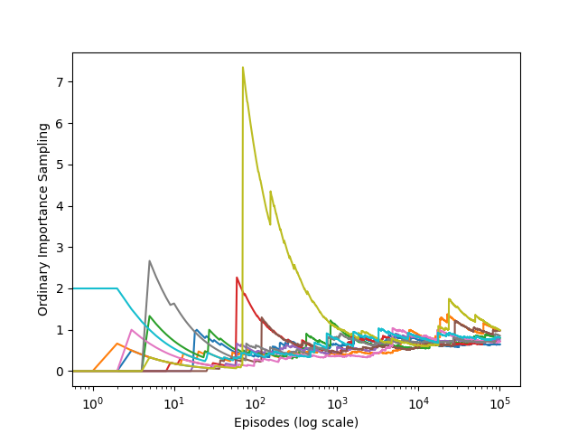

# Infinite Variance 
This project demonstrates the problem of infinite variance in ordinary importance sampling during off-policy evaluation, using a simple one-state MDP from Reinforcement Learning: An Introduction by Sutton & Barto (Example 5.5, Figure 5.4).

## Overview
In off-policy reinforcement learning, importance sampling allows the evaluation of a target policy using data generated by a different behavior policy. However, this can lead to infinite variance in certain settings, causing unstable and non-convergent estimates.

This project reproduces such a scenario through simulation and visualizes how ordinary importance sampling fails to converge, even after a large number of episodes.

## Problem Setup
* State space: One non-terminal state s.

* Actions:

  * right: leads directly to termination with reward = 0.

  * left:

    * 90% chance to return to state s

    * 10% chance to terminate with reward = +1

#### Policies
* Target Policy (π): Always selects left.

* Behavior Policy (b): Selects left and right with equal probability (0.5 each).

#### Expected Value

Under the target policy, every episode eventually terminates with a reward of +1. Therefore, the true value of the state is 1.

### Infinite Variance
The importance-sampling ratio grows exponentially with the number of left actions. Because episodes can loop many times before terminating, this leads to extreme values and infinite variance in estimates. As shown in the plot, the estimates remain volatile and fail to converge even after 100,000 episodes.

### File Description
* infinite_variance.ipynb: Runs the simulation and generates the plot.

* src/infinite_variance.py: Contains:

  * play(): Simulates an episode under the behavior policy.

  * behavior_policy(): Randomly selects left or right.

  * target_policy(): Always selects left.

  
* figure_5_4.png: Output image replicating Figure 5.4 from the book.

### Output
The output figure [(figure_5_4.png)]() shows the value estimates over episodes (log scale) across 10 independent runs, demonstrating the instability caused by infinite variance.

## References
 Sutton R.S., Barto A.G. - [Reinforcement Learning: An Introduction (2nd edition)](https://archive.org/details/rlbook2018/mode/2up)

